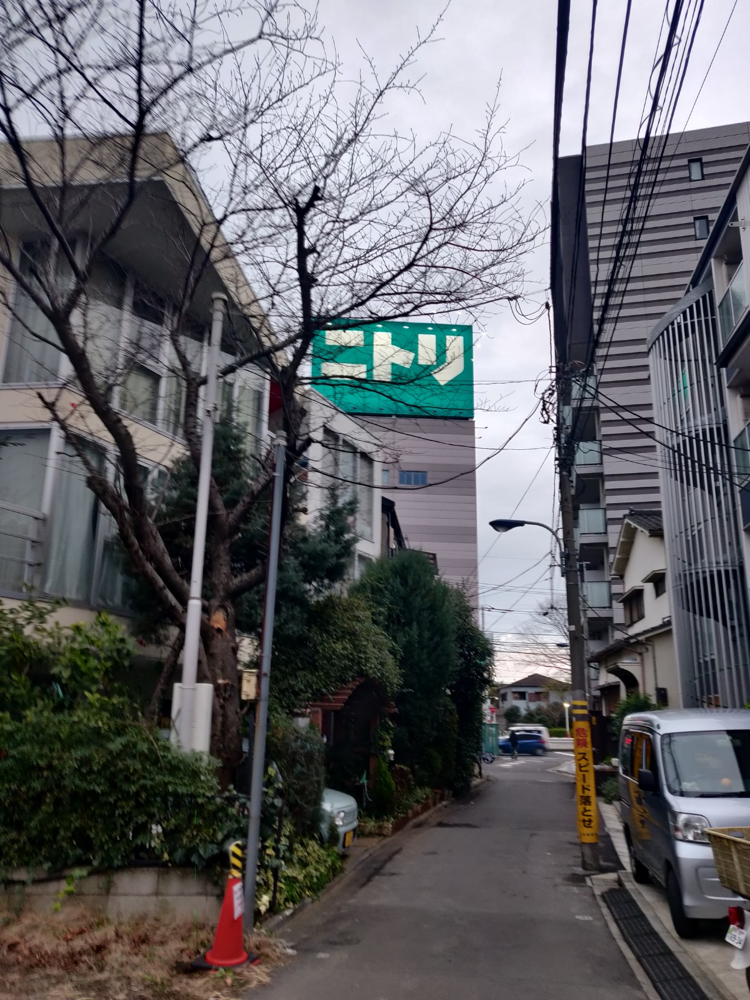
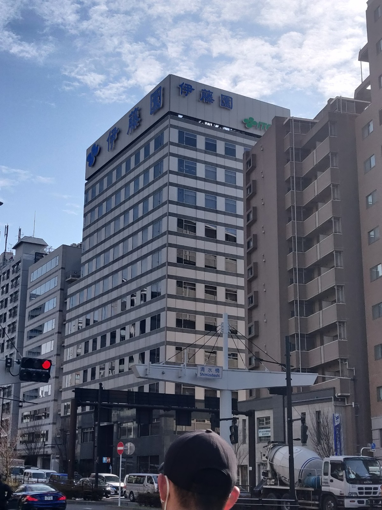
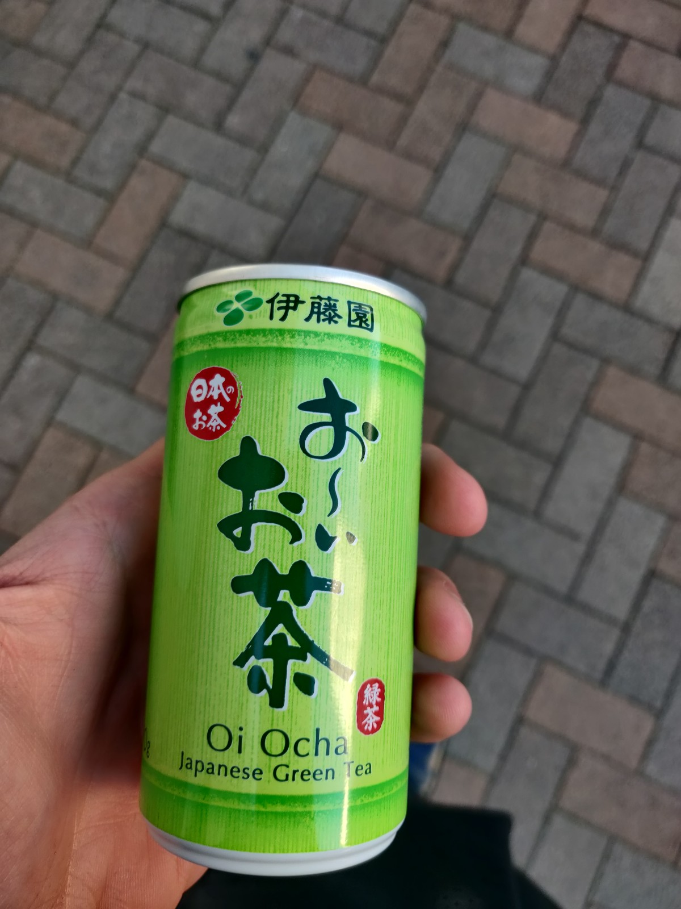

Hi there, so finally I have almost graduated from my undergraduate program which was in the G30 program. Now I am continuing to grad school in the same university, however I had to take an entrance exam and enroll in a different program. 

Before, I might have thought about leaving this university to seek for new experience, nevertheless I found quite a strong reason to stay for another 2 years. This reason is basically as I have only performed research for a year, I haven’t gathered enough data to publish a research paper, and thus by staying for another 2 years, hopefully I can finish my research and publish a paper ASAP.

Staying for another 2 years, however, isn’t as simple as I could not extend my undergrad scholarship which means I need to find another source of funding. Just so you know, tuition fee here is 267,900 yen per semester and there is also a matriculation fee of 282,000, plus it costs around 100,000 yen per month for lodging and food. Currently, I don’t have that much money and thus I had only 2 options: to look for another source of funding or end up doing part-time jobs which will definitely sacrifice my research hours. Luckily, my professor was kind enough to let me do part-time job in the lab, basically performing analyses unrelated with my work to get a little bit more cash. Even then, this will not be enough to cover everything and thus I knew I needed to look for scholarships. 

Actually, as I am graduating early, I also had another option, to stay another semester and graduating in September. This means that I can live off the current scholarship until I apply for another scholarship later on. I heard that there are more scholarships for international students around September as most international students follow the Fall entrance. However, I did not want to extend my study and I **intended** to attend the graduation ceremony at Osaka-Jo Hall (which was unfortunately cancelled due to the coronavirus outbreak).

So here goes my adventure:

## [Sato Yo International Scholarship Foundation](https://sisf.or.jp/en/)
Firstly, I was offered to apply to the Sato International Scholarship Foundation scholarship. Apparently, this is the first year that the international office for G30 students received slots to recommend students for this scholarship and I was lucky to be one of the students getting recommended. This scholarship rewards scholars with 180,000 yen monthly stipend and 100,000 yen per year on travel cost if you join conferences. This should be enough to cover my living cost and to pay tuition fee. 

The documents needed were basic documents such as the passing certificate, recommendation letter and forms, other than that we had to submit a typed research proposal and a written essay. So this was my first time writing essays and research proposal in Japanese so I had to ask around to help with Japanese. Anyhow, I was able to send the documents on time and I just had to wait for the results.

## Entrance to Graduate School of Osaka University 

As I had to submit the certificate of passing (合格証明書) for the Sato Yo scholarship around late September, I could not wait for the English course [(SISC)](http://www.bio.sci.osaka-u.ac.jp/global30/SISC/index.html) which did not start the intake until later in December (which I was planning to apply before the scholarship offer). I was forced to take the normal Japanese exam (院試), and I was not prepared. If I had TOEIC/TOEFL, I could have applied for the 特別選 or the selection by recommendation which skips the written exam straight to interview, however the bad news was I had not taken TOEFL since high school. Plus, if I were to take the TOEFL/IELTS/TOEIC, I would not have had the results by the time of the application. So I was left with no choice but to take the normal exam. At least I was allowed to answer half of the exam in English (I still had to answer the English exam in Japanese).

The application was straightforward, I just had to go through a pile of documents in Japanese. For most part, I just had to fill out personal information forms and write about 2 pages of essay on basically what I plan to do in the near future and what I did during my undergraduate study.

### The exam
I barely studied for the exam. I studied a bit by reading some parts of the Essential Cell Biology book around 2 weeks before the exam. The week before the exam, I had a [fluorescence imaging workshop (link in Japanese)](http://www2.nict.go.jp/frontier/seibutsu/CellMagic/) at Nishi-Akashi (Hyogo). I thought the workshop was going to be relaxed but boy I was wrong! I barely had sleep for the whole week and we had to work on imaging analysis for that whole week. I also forgot to bring the notes I made during my short study before going to the workshop so I ended not studying at all at the workshop. 

The next day was exam and I just did not care anymore as I was literally exhausted. The written exam consisted of two parts: Subject (Biology and optional Math/Chemistry/Physics) and English test. Honestly, it was quite easy, given that you understand the Japanese, fortunately I understood 80% of the questions and was able to answer. The interview, however did not go quite as planned, I was asked about my research and somehow I could not answer some of the questions. At that time I was a bit prepared to either fail or end up bottom of the result list.

### The result
The result was out several weeks after the exam and I was very surprised to find my name in the top 10 of the results list. Somehow I managed to get quite a high score in the English exam (I pretty much wrote everything in hiragana and katakana). Nevertheless, the only thing that matters is that I passed the exam and I can apply for scholarships! 

## The aftermath and application for other scholarships
Several weeks after the submission of the documents, I was notified that the results were on the foundation's website. I looked for my ID but could not find it, tried to look again for around 3 times until I had to admit defeat (LOL), I did not pass the document screening and thus was not invited for interview. 

After getting turned down, I went to look for other scholarships that didn't need university recommendation to apply. I looked at [Jasso’s scholarship list page](https://www.jasso.go.jp/en/study_j/scholarships/brochure.html) and found out there are several scholarships that I could apply with my current condition (without university recommendation). Here are the scholarships that I decided to apply to:
*	Nitori International Scholarship Foundation (80,000 yen/month) [100/?]
*	Honjo International Scholarship Foundation (200,000 yen/month) [12/191]
*	ITO Foundation for International Education Exchange (180,000 yen/month) [14/810]
Square bracket indicates the [accepted/applicants] for previous years.
For these scholarships I am going to write the steps below:
In general, it is probably advantageous to have a JLPT N1 before applying to these scholarships. 

## [Nitori International Scholarship foundation](https://www.nitori-shougakuzaidan.com/) 
We had to apply through web, enter personal information and simple questionnaires. After a while, they will contact if I pass the first screening and I had to take a web test, this test is basically an SPI test (Aptitude test), and I kind of had to ask people in my lab to help as I could not really understand the Japanese. However, I managed to clear the test (my scores were not that good tho) and was asked to submit documents. These documents include enrollment certificate, transcript, one page of essay (hand-written), Zairyu card+passport copy, letter of recommendation, copy of apartment contract and JLPT N1 results copy (optional). After submissions, I was notified that I had passed the document screening and will be interviewed in January.

The interview was held in the Nitori headquarters and the atmosphere was pretty calming, I actually made some friends and had quite a good conversation with the other interviewees, one of which actually had mutual friends in Tohoku University. The interview itself was only for about 10-15 minutes with general questions regarding my study, organizational activity, and future plan. I think it went smoothly and I was quite confident of the results.

 

Nitori headquarters in Tokyo.

 

## [Honjo International Scholarship Foundation](https://www.hisf.or.jp/)
Honestly, this one was the least troublesome to apply and the online system was also quite good. Furthermore, not a lot of documents were required and none hand-written. In general, the documents required were similar with the Nitori scholarship. The length of research proposal was also restricted and I could only write some parts of my research in the research proposal. 

The interview was held in the Ito-en headquarters in Tokyo, however there was no travel cost reimbursement, but we could opt for a Skype interview. I chose to have the interview at their headquarters, hoping to make a better impression. Arriving at the Ito-en headquarters, I was greeted by one of the staff which escorted me and another guy to the waiting room at the top floor of the headquarters. 

The waiting room was huge with really nice sofa. However that made me really nervous as not a lot of people were there, only the interviewees and the staff from the scholarship foundation. We were given a can of green tea while we wait which was nice. On the other side of the room, there was a display showing all of the products of Ito-en including Tully's Coffee. After around 15 minutes of waiting, I was told to enter the other room to be interviewed.

Contrary to the interview of Nitori, the atmosphere was quite tense as I was directly interviewed by the board at directors, the interview went quite smoothly for around 10 minutes. I was asked to introduce myself and was asked several questions regarding my future and my research. I was a bit surprised when they told me that my Japanese was good (I was expecting other interviewees to be twice as good). 

 

&nbsp;

Left: Ito-en headquarters in Tokyo.

Right: Oi Ocha I received when I was waiting for my interview.

 

## [ITO Foundation for International Education Exchange scholarship](http://www2.itofound.or.jp/)
This scholarship was not that competitive, and probably for a reason. There were a lot of **Japanese** essays to be submitted. Most of which had to be hand-written. Took me several days just to finish the essays and that is probably the reason. Most of the communications were done by mail and by phone but I think everything went pretty smoothly. 

After about a month, I was notified that I was subject to another round of screening (interview) which was held in Tokyo and all the guide was by mail and I had to notify them by phone.

## (Bonus) MEXT Super Global University scholarship
Halfway through the application, I was notified about the SGU MEXT scholarship which is a MEXT scholarship recommended by the university. This scholarship is basically a MEXT scholarship which awards 145,000 yen per month (If I’m not mistaken) and the tuition fee is fully covered. There is a caveat however, in which the scholarship is only valid for a year and the . 

The procedure was quite simple, I just had to fill in some forms and have my professor make a recommendation letter. The documents were then sent to the faculty and then the headquarters office where the final selection took place.

No interview took place and it was solely dependent on the university's selection committee. 

## The result
I later found out that I was not selected for this scholarship by a close margin, and thus I was quite disappointed at the results. However, at that time I was still hoping to receive the other scholarships.

Literally the day after the Honjo scholarship interview, I received an email notifying that I have been selected as a recipient for this scholarship. I was so happy and a bit surprised as this was the most competitive scholarship I applied to. Right after the notification, I replied that I will receive the scholarship and thus I needed to cancel the others. 

At this stage, I was still waiting for the result of the Nitori scholarship. I later found out that I was also selected for the Nitori scholarship, however had to withdraw as both of the scholarships did not allow scholars to receive another scholarship.

I also cancelled the interview for the Ito Foundation for International Education Exchange scholarship the day after the acceptance of the other scholarship, so unfortunately I can't give insights on the interview.

Thinking about it, I was very lucky that I failed the SGU MEXT scholarship or I wouldn't have been able to accept the Honjo International Foundation Scholarship.

The support given by the Honjo International Scholarship Foundation has been fantastic. The orientation and welcome party were actually scheduled to be at the end of March, but had to be cancelled due to the coronavirus. Scholars also get invitation to attend networking events and other events hosted by the foundation.

So here are my tips for you who are applying for scholarships:
* Try to make your research understandable to people from out of your field by avoiding jargons and technical terms 
* Be confident
* Have a clear vision of what you want to do and/or be in the future
* Never give up

Til then!