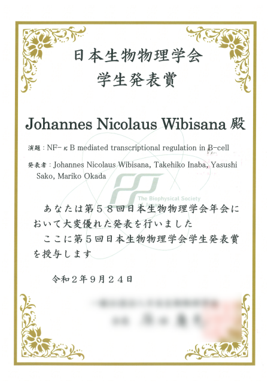
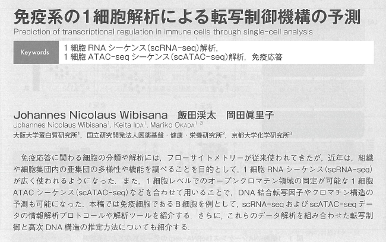

So COVID struck while it's been like about a year since my last post. A lot of things happened this year, I learnt new experimental techniques, got an award at a domestic academic conference and got my first review article published, in Japanese though! So in this occassion I would like to write about things that happened this past year.

## Learning new experimental techniques

Well, things started to get boring in my research project and I challenged myself to do cloning experiments. For those of you who do not know what cloning is, basically it involves creating an expression vector (which in my case is a plasmid) which can be introduced to a host cell and induce wanted gene expression. For example, you can introduce an expression vector containing GFP (Green Fluorescent Protein) to a cell and they will glow under GFP excitation spectrum. I think some of the DNA vaccines currently used for COVID-19 follows a similar principle so you can google that out!

Unfortunately, nobody in my lab is currently doing cloning and I was pretty much left to figure things out by myself. On the other hand, I had a supervisor from another university with a research collaboration which helped me a lot during the experiments, even though only through email and Zoom. Nevertheless, it was a really fruitful experience. I had zero experience when I started causing me to end up failing a lot of experiments, but it was very rewarding as now I got a new skill and I can now plan cloning experiments by myself.

After that, using the same technique I also started doing CRISPR-Cas9 experiments. These experiments turned out to be very simple, you just need to get the information on the genomic position you want to knock out, design your guide RNA and proceed with cloning to a suitable vector. It's very simple, no wonder it changed the field of genome editing and won some of the pioneers in this technology a Nobel Prize.

If you are interested, maybe take a look at this page: it contains most of the information you will need in designing your own CRISPR-Cas9 experiments!

[Addgene: Zhang Lab CRISPR Page](https://www.addgene.org/crispr/zhang/)

## Getting my first conference award

As I said before, I joined an academic conference which was unfortunately held online. It was a domestic conference on Biophysics （生物物理学会）. It was supposed to be held in Gunma, but unfortunately as we all know due to COVID-19 restrictions, it was held online. 

My impression on the conference was that it was not really fulfilling, I had 0 interactions with other people which was really bad considering academic conferences are usually where you get to know people in your field. The organizer lets us upload a poster where people can comment and ask questions. However, it was designed in a way that makes asking questions sort of difficult, it's kinda hard to explain, but I would say it's more like commenting on a Facebook post and not like a Discord chatroom (not sure if this is a good example tho LOL). 

As we all know, Japanese people also don't tend to ask a lot of questions, especially when dealing with foreigner, it might also be why I basically had 0 question on my poster hahahaha. I wrote that it's fine to ask in Japanese tho... Guess there's also an impact of having the conference in that kind of format. Maybe having private Zoom video chat rooms will be more interactive?

I guess nobody was to blame, it was their first time doing the whole thing online. On the other hand, I do think that they need to change the format if they want to do another online session in the future.

Well I got a poster presentation award after getting some senior researchers look. I don't know if this is good or not but at least I got something from this conference...

 

Certificate I got for the award.

 

## How I managed to write a journal article in Japanese

A couple while ago I was invited to write an article about single-cell epigenomic analysis by my professor and I was like ok I'll do it.. except that it was supposed to be in Japanese and I have never actually wrote an actual writing in Japanese.

Let me briefly explain the contents of this article. I mostly discuss single-cell RNA-seq and ATAC-seq techniques and its applications on understanding epigenetic regulation in immune cells. I also write about currently available analytical techniques and how it is used to uncover complex immune cell differentiation through an epigenetic perspective. I took the time to try and make the article easy for most biologists, even those coming from different backgrounds, so hopefully it will be easily understandable for readers.

I had quite a hard time writing this article actually. Firstly, I wrote things in English, then I had one of the assistant professors help me with translating my writing to Japanese. Finally, we discussed around the translated version. At first it was a bit difficult, but revising the work was not really as hard as making it, somehow 1.5 years of Japanese working environment was enough for me to adequately understand technical terms and Japanese writing style. I'm sure that this won't apply only to me, I firmly believe at the saying "when there is a will there is a way" and I think this proved that.

So here's the resulting work, it is published in the Journal of Clinical and Experimental Medicine (医学のあゆみ) under the title "prediction of transcriptional regulation in immune cells through single-cell analysis (免疫細胞の１細胞解析による転写制御機構の予測)". Unfortunately it is unavailable online, but let me know and I might be able to hand you a copy!

[医学のあゆみ　276巻10号　2021年3月6日](https://www.ishiyaku.co.jp/magazines/ayumi/AyumiBookDetail.aspx?BC=927610)

I am also thinking about writing a similar article on my blog in English as I am quite sure most of the readers here do not speak nor read Japanese, let me know if anyone's interested!

 

Abstract of my published article.

 

## Getting back up after failures

As I said before, I have had my share of failures in the last couple of months. Nevertheless, it wasn't necessarily a bad thing as I learned quite a lot. It used to take me more than 2 weeks to finish a cloning experiment but then now I can come up with nice results within a week. I guess the moral of the story is to never give up. You just don't know what lies ahead.

## So what's up next?

Right now, I am currently preparing for my first peer-reviewed publications. It took me quite a while to be able to get enough results for one but I guess I am quite relieved that I was finally able to make decent progress.

I am also currently looking for PhD positions abroad or maybe in Japan. I'm more interested in a position abroad tho, as I'd like to get some experience in a new environment. Japan had been great, but I think it's time for me to get a broader perspective on how the research field works. Just hoping that I will be able to learn even more in my next post. I'm also open to working in the industry, as long as I can learn even more things.

See you next time!
