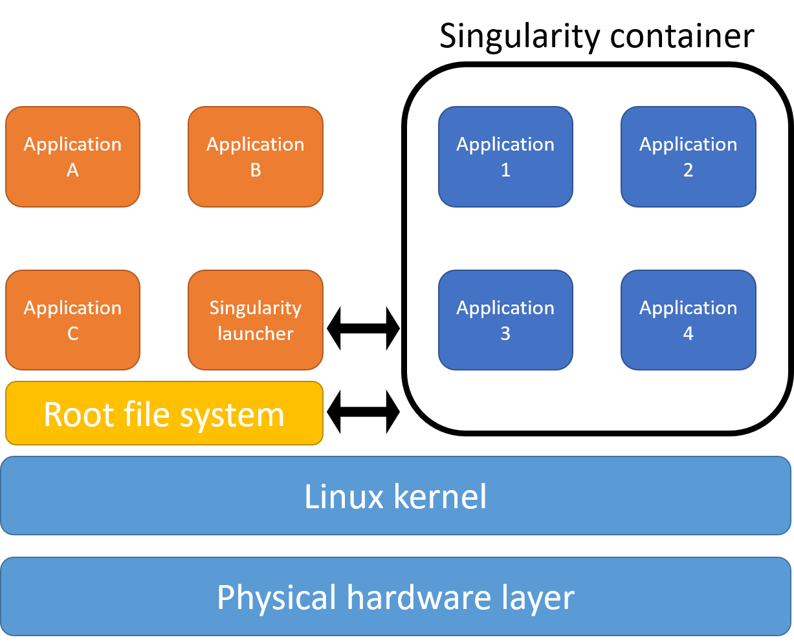

I was working on a huge dataset using R and ran out of memory on my desktop PC. I then tried to install R on HPC, but then I run into a dependency hell, especially where some of them needed some sort of root privileges to install. So, I resorted to using Singularity, which alleviates these problems.

## What is Singularity

Singularity is a system similar to docker where you can isolate packages inside a container. You can then run the container and run the packages inside just like any other packages.

A Singularity container is a portable container which contains installed packages and kernel needed to talk with the hardware. In a sense, it is similar to a virtual machine, however it is more compact.

Some of the advantages of using a container in your workflow is that it adds reproducibility, as you can share a container with fixed version of packages to your colleagues. You would also be able to run packages which needs administrator privileges to compile by compiling it first locally.

Basically, you just build and install all the needed packages on your local computer onto a container, then you copy that container to the HPC and then you can run it without installing.



Adapted from: [here](https://alibaba-cloud.medium.com/building-a-high-performance-container-solution-with-super-computing-cluster-and-Singularity-4115a88679be)

## Prerequisites

- A unix local system (with administrator privileges)
  - Linux
  - WSL2 (Error will be produced during building of container if using WSL1), check [here](https://docs.microsoft.com/en-us/windows/wsl/install-win10) for details on how to upgrade WSL1 to WSL2
  - I'm not sure if you can use OSX, but I guess it's possible
- HPC account
- Internet
- Patience

In this tutorial, I will be showing how to to the following workflow using Windows with WSL2 installed.

## Workflow

1. Installing Singularity in local system (Adapted from: [here](https://sylabs.io/guides/3.7/user-guide/quick_start.html))
2. Building a Singularity container
   1. Installing R
   2. Installing required packages
3. Copying container to HPC and subsequently running it


## Procedures

### 1. Installing Singularity in local system

Install pre-requisites
```shell
$ sudo apt-get update && sudo apt-get install -y \
    build-essential \
    libssl-dev \
    uuid-dev \
    libgpgme11-dev \
    squashfs-tools \
    libseccomp-dev \
    wget \
    pkg-config \
    git \
    cryptsetup
```

Install GO as Singularity is written in GO programming language

```shell
$ export VERSION=1.16.4 OS=linux ARCH=amd64 && \  # Replace the values as needed
  wget https://dl.google.com/go/go$VERSION.$OS-$ARCH.tar.gz && \ # Downloads the required Go package
  sudo tar -C /usr/local -xzvf go$VERSION.$OS-$ARCH.tar.gz && \ # Extracts the archive
  rm go$VERSION.$OS-$ARCH.tar.gz    # Deletes the ``tar`` file
```

Add GO to your environment variable (change `zshrc` to `bashrc` if you're using bash)

```shell
echo 'export PATH=/usr/local/go/bin:$PATH' >> ~/.zshrc && \
  source ~/.zshrc
```

Download and install Singularity from [here](https://github.com/hpcng/singularity/releases)
```shell
$ wget https://github.com/hpcng/singularity/releases/download/v3.7.3/singularity-3.7.3.tar.gz && \
    tar -xzf singularity-3.7.3.tar.gz && \
    cd singularity
```

Compile the Singularity source code
```shell
$ ./mconfig && \
    make -C builddir && \
    sudo make -C builddir install
```

### 2. Building a Singularity container

Make definition file to start
In this case, we will be using Ubuntu 20.04 image.

- The section `%post` defines package installation, and other local configuration.
- The section `%runscript` defines a script to run when the Singularity image is run.

``` shell
Bootstrap: docker
From: ubuntu:20.04

%post
  apt-get -y update && apt-get install -y vim

%runscript
  echo "hello from our custom Singularity image!"

```

We will save this file to a file named test-image.def

Then, we want to build the Singularity container using the `--sandbox` mode, so that we can interactively work with the container instead of writing everything on the .def file. This is good for testing the container, while you might want to write everything in the .def file for documentation purposes.

```shell
$ sudo singularity build --sandbox test-image test-image.def
```

If the build failed, double check if you have converted to WSL2 from WSL1 using the following command in command prompt.

```shell
$ wsl -l -v
```

once you finished building the container. You should have the folder test-image. 

Then, run the Singularity container shell 
```shell
$ sudo singularity shell --writable ./test-image
```

Now, you are inside the container and can install any packages that you need. In this case we will be installing R and some packages.

Firstly, install some libraries that might be needed. You could also put this in the .def file prior to building the container.
```shell
$ apt install build-essential
$ apt install libssl-dev
$ apt install libxml2-dev
$ apt install libcurl4-openssl-dev
```

Then, we install R (4.0).

Firstly, add R repository for Ubuntu 20.04.

```shell
$ apt-get install software-properties-common
$ add-apt-repository 'deb https://cloud.r-project.org/bin/linux/ubuntu focal-cran40/'
```

Then, we may need keys.
```shell
$ apt-key adv --keyserver keyserver.ubuntu.com --recv-keys E298A3A825C0D65DFD57CBB651716619E084DAB9
```

Next, we install r-base.
```shell
$ apt-get install r-base
```

If it is successful, you should be able to run R.
```shell
$ R
```

Once you get into R, you can install the packages you want. For example:

```R
install.packages("dplyr")
install.packages("Seurat")
```

Once you're done installing packages, you can quit R.

```R
q()
```

Then you can quit your container

```shell
$ exit
```

By now, you should have a container with a working R and your wanted packages, in this case dplyr and Seurat.

Now that you have your container setup, you can continue to the next step, which is transferring the files to your remote server (HPC) and running it there.

### 3. Copying container to HPC and running it

We can copy our container to the HPC, however as we built our container using the `---sandbox` option, we have a folder containing all the needed components to run the container.

Therefore, it is more efficient if we compress the files to a tar.gz file. We might need administrator rights here.

```shell
$ sudo tar -czvf test-image.tar.gz ./test-image
```

Next we can transfer this tar.gz file to the HPC using SCP.

```shell
$ scp test-image.tar.gz username@10.10.0.2:~/remote/directory
```

Then we can login to the HPC and unzip the Singularity container.
```shell
$ tar -xvf test-image.tar.gz
```

You can try to run R interactively using the following command on your HPC, where test-image is the unzipped Singularity container:
```shell
$ singularity exec test-image R 
```

To run scripts, you could use the following command:
```shell
$ singularity exec test-image Rscript your_script.R
```

There you go, you should now have a working container containing packages that you need for running in your HPC.

This will not only be useful for running R but you could also run other packages this way, and you will be able to easily maintain the version of packages.


