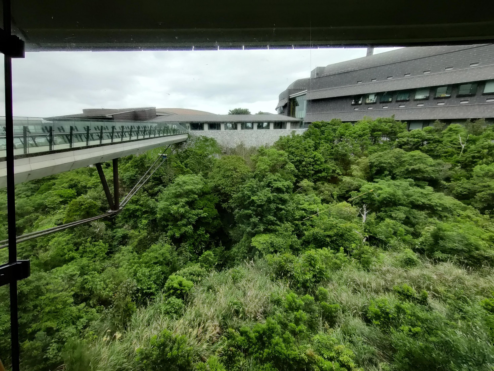

Hi there, I haven't updated this blog for so long! I have been busy with research and the whole pandemic did not help with the current situation. But, to recap things that happened in the last 2 years:

I have finally finished my Masters in Osaka University and is currently. There were quite a lot of hurdles during my master’s study, mostly with research, and the pandemic. Nevertheless, it was largely fruitful, I was able to finish with 4 publications as the first author: a [research paper](https://www.biorxiv.org/content/10.1101/2021.07.13.452147v2), which is currently under minor revision, a review paper which is also under minor revision, a book chapter about fluorescence imaging methods which should be published soon, and another [book chapter](https://www.ishiyaku.co.jp/magazines/ayumi/AyumiBookDetail.aspx?BC=927610) in Japanese about single cell analysis. Now, I’m on my way to Okinawa, Japan, to start my PhD at Okinawa Institute of Science and Technology (OIST), which is a new and very beautiful campus surrounded by spectacular beaches.

<figure class="half">
    
    
    <figcaption>Front gate of Okinawa Institute of Technology and the beach 5 minutes walk from there.</figcaption>
</figure>

In this post, I will be mostly writing about the process on how I was able to secure a PhD position. I pretty much got accepted to all the PhD programs I applied to (well, honestly, I only applied to 2 places) and I almost got an offer for a job (at least I think so). Hopefully, my experience will also be helpful to those still thinking about going for PhD too!

## Why bother going PhD

Embarking on a PhD is not an option for most people. It will easily take 3-5 years of hard labor and low pay; some might even break your bank! It's just probably not an option if you want to settle down and earn money. That’s fine, I think, a PhD might not help much if you want to go to the industry. But for me, I want to learn more, contribute to science, and to do science independently. Furthermore, I couldn’t care less if I were rich or not, that may come later. These reasons led me to where I am now, doing my PhD.

## Applying to a pharmaceutical company

At first, I was thinking about getting a bit of experience by working in the industry for several years before embarking on a PhD, at this point my research was kind of stagnant and I felt like it could also serve as a good break.
So, at the same time with my PhD applications I decided to apply to a pharmaceutical company which did all screenings in English as I couldn’t be bothered to do those stuff in Japanese. Anyhow, at this point, job hunting was pretty much over, and I had not a lot of options left.

I then prepared my CV and motivation letter without double-checking and submitted them. Luckily, I was invited for the first interview, probably because they were looking to start a new department which coincides with my field of expertise: computational biology. Then I was invited to a first interview, where I talked about my research. Here, I felt that they were really interested in hiring me. Though one thing really made me doubt, when I asked about the computational infrastructure available, they did not have any yet and expected me to initiate it. This was beyond my expertise and felt like I can't develop myself much here.

After the first interview, I waited for several weeks and got an invitation for the 2nd interview. By this time, I ended up getting some nice results and was close to getting my research published (or at least close to submitting a research paper). At this time, I thought that I might as well just go straight to PhD. I also has a bit of thought that being in a Japanese company means that I will most likely be exposed to a similar environment, which eventually set me back.

After thinking for a while and discussing with family and friends, I decided to withdraw my application and focus on getting a PhD position, as I believe that I still have so much to learn. Well, the industry can always be an option in the future in case I fail academia.

## Considerations for PhD programs

For my PhD, I was thinking about somewhere I can do cutting-edge basic research. I’m not really interested in applied research. Of course, I also took the environment (be it research or social) and the benefits, while most importantly the research topic and the PI into consideration.

At first, I had a short list of PhD programs I was planning to apply for in order of preference:

- European Molecular Biology Laboratory (EMBL), Heidelberg, Germany
- Center for Genomic Regulation (CRG), Barcelona, Spain
- École Polytechnique Federal Lausanne (EPFL), and 
- Okinawa Institute of Science and Technology (OIST)

I have also contacted some of the PIs at some of these institutions and some of them responded nicely. However, I ended up only applying for two, which is primarily because of getting accepted to OIST early on. OIST checked most of the boxes that I looked for in a PhD program. At first, OIST was my backup as I really wanted to leave Japan, being here for a total of 6 years at the time of my graduation. However, things changed dramatically along the way, and I believe that I made the right choice.

## PhD applications

### Okinawa Institute of Science and Technology

I applied for OIST early, as it is a 5-year program and requires only a bachelor’s degree, meaning I could apply during the first year of my masters. I remember applying for the September 2021 intake and requested to defer. At first, I did not think much about it as it was just a backup. I went there a couple of years ago and the campus was fantastic, but it wasn’t really a first choice as I wanted to leaving Japan.

<figure>
        
    <figcaption class="my-auto">Young me in 2019.</figcaption>
</figure>

Fortunately, I was invited for the admissions workshop, including interviews with some of the faculty members. We were supposed to visit the campus, but unfortunately it was still COVID, and they cancelled the on-campus admissions workshop. We had to attend presentations about student support online, even the virtual lab tour got cancelled due to the current situation at that time. The financial and student support in general is probably one of the most generous in the world and got me a bit interested. Then, during the interviews, I remember getting asked about my motivation in coming to OIST, and about my research. I had some very meaningful scientific discussion with some of the PIs and that sounded great. Nevertheless, what made me sure that I want to go here was after talking to my current rotation lab PI, Nick Luscombe. After talking to Nick about. He also seemed very enthusiastic in taking me in as a PhD student. He seems to also be a very good mentor and is a well-known scientist in the field of computational biology.

Then, about the research project, I had doubts about working with planktons, you can’t really see them, and they don’t seem significant. However, I learnt later that they possess interesting genomic structures. The "same" species have scrambled around genomes, and that the mechanism is not yet clearly understood. This is quite cool as it can possibly lead to discoveries of a new mechanism of gene regulation, which might or might not be applicable to humans.

Moreover, I am also expected to learn about the basics of reproducible bioinformatics research, which I never had back in Osaka. Most places expect results without process, and this is not that place, which I think is ideal for a self-taught bioinformatician like me.

For me, I have always wanted to study something that is “useless”, e.g., dinosaurs, but I never had the chance to. While not necessarily as “cool” as dinosaurs, I think that this is a good step for me to take as I will have the chance to work with non-model organisms, and to learn the basics of bioinformatics that I can apply to more biomedical projects in case I'm going back to biomedical-oriented research.

Aside from that, it is interesting to have lab rotation on the first year. Here, I get to try different research, even something that’s out-of-field. This means I can learn and experience new things and decide what’s best for me. This was also quite pivotal for me in my final decision.

One major drawback though is that this university is in the middle of nowhere. It is surrounded by beautiful beaches and the air is very clean, sure, but without a car it is tremendously difficult to live a normal life. Currently, I still don’t have a car and is trying to survive with a 50cc scooter.

### École Polytechnique Federal Lausanne

École Polytechnique Fédérale de Lausanne (EPFL) was also on my list. This institute is a highly established institute which has a good reputation. They have really good computational infrastructure and also connection with the University of Lausanne. The salary is also quite high, while the cost of living is quite high as well. I ended up applying here because the application was also open quite early like OIST. As usual, I prepared my CV and my recommendation letters from my current and previous professors and submitted them to their online system.

Then, after a while, I was invited for an interview, where I presented about my work on transcriptional regulation in Osaka. I was also able to talk to PIs that might be interested in recruiting me as a PhD student. However, I saw that their research was highly applied and biomedical, and I wasn’t really interested in that. I felt like I could use a break doing something else different.

After the interviews, I was told that I was accepted to the school, but I still had to find a PI in a year, as I couldn’t find a suitable PI during the admission process. The next month, I was contacted by one of the PIs if I would like to work with them on a project, which while to an extent, relevant to my previous project, I wasn’t really interested.

Therefore, I gave up on EPFL and decided on OIST. Which might have been the right choice.

## What now?

Fast forward to 2022, I arrived at OIST. It’s a small community, everyone knows everyone, and nobody feels distant, everyone is so welcoming! I got new friends, and my first few weeks have been great. The view is spectacular, the beaches, the labs, the buildings, everything is just perfect.

<figure class="third">
    
    
    
    <figcaption>Sunset from the beach about 5 mins walk from campus, the view from my lab, and coffee after lunch.</figcaption>
</figure>

## What ultimately helped me land a PhD position, some tips from me

Indeed, applying for PhD is not that simple, I’ve heard people who applied to more than 20 places and only got 1-2 offers. So here are some of my advice, they may be highly opinionated, but got me through my PhD application processes.

First, understand your research inside out. You should be able to explain what you did during your research and how important is it in your field. Not only that, but also how it can be developed further and the potential implications. Then, do not talk beyond your capabilities and be eager to learn new things, basically don’t lie, most people applying are probably on the same level as you. Finally, you should be curious. Ask questions. Asking questions will spark further discussions between you and whoever it is interviewing you. On top of that, you should have a clear goal on what you want to do in the future, be it in the academia or in the industry. Good luck!