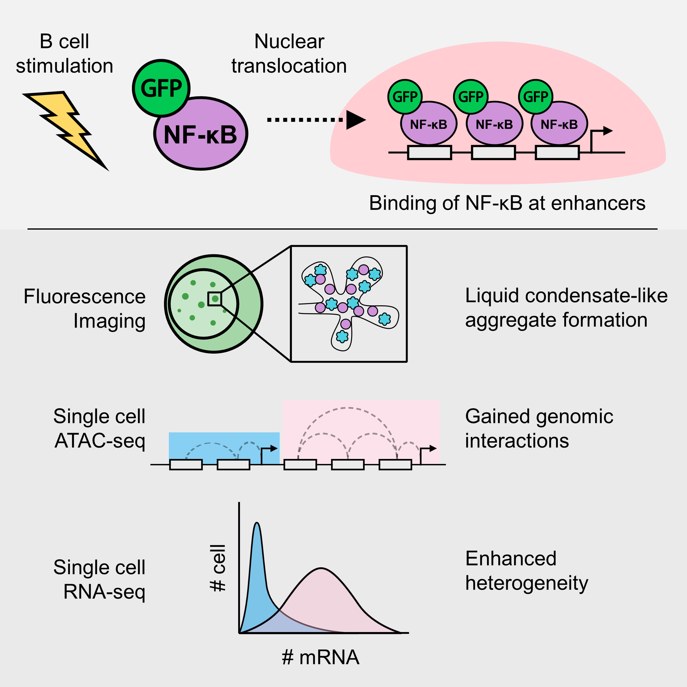

After a year long review, my first paper finally got published: [Link](https://journals.plos.org/plosgenetics/article?id=10.1371/journal.pgen.1010235). The paper went through 3 rounds of revision, where I believe that the 3rd round was not really necessary and added ~2 months to the review process. Nevertheless, I'm delighted that the paper is finally published on PLoS Genetics

Just to summarize my paper, it's a study about the transcription factor (TF) NF-kB. This transcription factor translocates to the nucleus upon cell activation, in this case B cell. I visualized the formation of molecular aggregates that occur in the nucleus that involve NF-kB, DNA and other transcription related proteins using fluorescence microscopy, and finally predicted that the generation of enhanced genomic interactions because of this aggregates eventually lead to variability in gene expression.

<figure>
        
</figure>

## The long path to publication

While it may sound straightforward. Reaching the end of this project took quite a bit of time and a lot of trial and error. It took me 3 years, from being a clueless undergrad to being somewhat knowledgeable in the field. (I still think I don't know a lot of things tho!).

### How it all started

It all started when I was an undergrad, looking at labs for my 4th year thesis project. I was told by my former PI that there was a project that involved fluorescence imaging, in which I can be the sole investigator. Moreover, I also had around a month of free time before the start of my undergraduate research and being involved in this project meant that I can do some kind of work at that time. This project was very exciting to me as it gives me independence, which might be good or not depends on how you look at it, but for young me, it was an opportunity for me to give my best in completing the project.

I initially planned to leave Japan at the end of my undergrad, but at that stage, we realized that we did not have enough data to complete the paper. I then decided to stay for Master's, initially only to finish the research project and publish a paper. I'm glad I was able to secure a scholarship from the Honjo International Scholarship Foundation, so that I didn't need to worry too much about funding during my Master's.

### Initial ideas and plans

At first, the project was simple. To investigate what these nuclear aggregaets are, and how they affect gene expression of target genes. That's it, and so I had to do an extensive literature search on the possible mechanisms. Here, I was taught about the concept of super-enhancers, where multiple enhancers in close proximity can work together through the aggregation of transcription factors and other proteins, to activate a higher level of gene expression.

### The discovery and change of ideas

By reading more and more papers, I got several ideas on the biochemical properties of these aggregates. At first, I was just pretty much following orders, and analysed the data in a way that does not fully utilize the data. After a while, I was more comfortable with programming and felt more free in exploring the data, where I found that some genes showed different patterns of gene expression across doses. This finally became the main topic of discussion of my paper.

## Things that did not go according to plan

### "Broken" microscope

The microscope I used throughout this research was mostly the confocal microscope given from RIKEN. This was transported all the way from the outskirts of Tokyo to Osaka. After setting-up the microscope, I found out that the images produced were highly noisy. Later, they found out that the engineer installed a filter backwards, and I ended up wasting a month or so here waiting for the people from the microscope company to fix the problems.

After a couple of months, I realized there was another trouble where the laser got very weak and the images produced were highly noisy. This time, the fix came quite quick, and I was able to continue experiments straight away after 1-2 weeks. If I'm not mistaken, some of the mechanical parts were moving around and thus the efficiency was reduced.

<figure>
    
    <figcaption class="my-auto">My trusty confocal microscope.</figcaption>
</figure>

### Software dependencies

Reproducibility has been plagueing bioinformatics research since forever and my limited bioinformatics knowledge at that time was in no way immune to that. If you are concerned about this, you might want to check this [paper](https://www.nature.com/articles/nbt.3820) out!

The problem at that time was because of COVID, we had to work from home and I tried to switch to a different high performance computing environment in the middle of my research. I tried to replicate my previous environment including software versions. Here, I tried to use conda, but it turned out to be a disaster as some software actually showed different computational results. While most of the differences were minor, they were large enough to change the outcome of the major genes I was focusing on.

At that time, I learnt everything mostly by myself and certainly no one ever taught me about reproducible research. This is one of the reasons why I chose to move here to OIST, where I'm learning to create reproducible bioinformatics pipelines. Currently, I try to containerize my work most of the time using Docker and Singularity, when working with R, I always try to use renv, and I always try to use nf-core to run NGS pipelines!

### COVID-19

COVID-19 hindered my progress by quite a bit. Firstly, it was difficult to work from home, while I had a pretty decent PC back then, it was still difficult as it was not as good as the PC at the lab. I also had to access my data remotely, which was not really convenient. However, what was most difficult was the inability to do wet experiments. As at that time I still needed more data, it was quite a hindrance when we were unable to go to the lab for several months.

### Creating a mutant cell line

With the cell line I was using, immunofluorescence (IF) was almost impossible. At that time, I was trying to figure out the co-localization between NF-kB (GFP) and BRD4. At first, we thought we did IF properly and we were able to get decent amount of co-localization between these proteins, but I realized that most of the signal was just autofluorescence of the GFP and thus were artifacts.

Well, that was not good, so I discussed with Prof. Akira Imamoto from Chicago University to ask about creating my own cell line that expresses RFP-tagged BRD4 proteins. I found out that it was not that simple, as it included sooo many steps to confirm that the experiments were not flawed or biased. I firstly needed to design the experiments using cloning software, sequence all the vectors I obtained from cloning, and of course sequence the cell lines overexpressing the target protein upon transfection.

I used the Gateway cloning technique to incorporate the genes expressing for the BRD4 proteins into an expression vector. I actually had some problems along the way as I was using a fairly old reagent and found out that some of the clonings failed multiple times because the efficiency was too low. I'm glad that I was able to solve this problem after using unopened (albeit old) reagents which had fairly higher efficiency.

I also had problems with transfection efficiency, where it was less than 50% for DT40. Despite that, I managed to get a single clone after using serial dilution to culture transfected cell on a 96-well plate, it took me more than 3 months in total to finish these experiments.

### Failed CRISPR-Cas9 experiments

As I was predicting DNA-DNA interactions, I wanted to validate if these regions actually behave like how I predicted in-silico. I resorted to using CRISPR-Cas9 to induce long-deletions in the genome, spanning putative enhancer regions. I was lucky that my lab had connections with Prof. Kawaoka at Kyoto University (currently in Tohoku Univ.). I discussed with him about the strategies needed to remove these putative interacting genomic regions before performing further gene expression validation experiments.

With the experience I had from making overexpression cell lines, I was up for the challenge. I was so wrong to think that this time, it was gonna be easier, it never got easier. Firstly, to remove a certain stretch of genomic region, I would need to target 2 different sites of deletion, where the Cas9 proteins can induce double strand break and by chance non-homologous end joining may occur. As I was targeting multiple targets, and that for each target I prepared multiple guide RNAs (gRNA), I ended up with so many combinations of plasmids which I needed to make. This is also caused by the difficulty in transfecting the cell line, which required me to design plasmids that each include 2 different gRNAs, as transfecting 2 different plasmids with single gRNA is too inefficient and is probably statistically almost impossible.

Indeed, while the cloning experiments were relatively optimized and rather easy, it was still very very laborious. Further, I had to get single-cell clones which took weeks, and sometimes the clone only have half of the chromosomes deleted, in which I needed to do another round of selection.

These experiments took me in total almost half a year to complete, only to realize that somehow the cells are not doing well after the deletion of some minor genomic regions. I wasn't even able to induce deletions at some of the regions I targeted. So, the CRISPR-Cas9 experiments were pretty much a failure, but I learned a lot and implemented the techniques to help other people too!

## Review, review and review

We decided to submit the paper to (Review Commons)[https://www.reviewcommons.org]. Review Commons is a platform where revisions from the first round of review can be transferred to any one of their affiliate journals. In general, it is supposed to reduce review time, as manuscripts can be transferred with a click of a button to journals after the first round of revision.

### First revision

After around 2 months, we received the first set of reviews from a total of 2 reviewers. The first reviewer was fairly supportive of our results and only demanded a bit more changes to strenghten our discussions. Reviewer 2 however, was more critical of the results and demanded quite a bit of further exploration on the data and some additional experiments to prove our points.

In general, we were told that the conclusions and results taken over the course of the paper was not conclusive and did not show major "conceptual advance". At this stage, I do agree with most of the comments given by the reviewers. Therefore, we decided to do a major revision, where we add new data and perform many new experiments. These additions added quite a lot to the paper, it went from (this)[https://www.biorxiv.org/content/10.1101/2021.07.13.452147v1] to (this)[https://www.biorxiv.org/content/10.1101/2021.07.13.452147v2].

### Submission to PLoS Genetics

As the paper was on Reviewcommons, we were able to submit to a select number of journals. We firstly submitted the paper to another journal, which is actually one of my favorite journals. Unfortunately, it was rejected, as it lacked "conceptual advance". Maybe it was, or maybe the editor were mostly concerned about the first round of reviews, and did not consider the additional data and results we brought forward.

Then, we submitted the paper to PLoS Genetics, which was also a very good journal, but I felt like it was a bit out of topic, as my paper wasn't really about genetics. Nevertheless, it went through, and after 2-3 weeks it was under another set of reviews. The 2nd round of reviews were actually very helpful, as the reviewers pointed out some of the weaknesses in our paper which we agreed. Thus, we added further justifications and analysis, and alter some of the text. However, weren't really delighted about a 3rd round of review, which did not add anything useful to the paper and took us another 1.5 months.

In total, after about a year of the review process, our paper was finally formally accepted and is now published. Honestly, it could've been faster, but I guess it's not too bad for my first publication.

## Explaining the paper

I will now explain the paper step-by-step, to make it (hopefully) easier for people which are not as well-versed in this field to understand.

### Introduction

Basically, this research builds up on the previous papers by [Shinohara et al.](https://www.science.org/doi/10.1126/science.1250020?url_ver=Z39.88-2003&rfr_id=ori:rid:crossref.org&rfr_dat=cr_pub%20%200pubmed), and [Michida et al.](https://www.cell.com/cell-reports/pdf/S2211-1247(20)30701-4.pdf) I feel that the latter paper could have explored the data more, as they tried to use single-cell data as bulk data, averaging the expression data and does not capture single-cell expression dynamics.

Therefore, in my research, I aimed to utilize the single-cell data as much as possible, while adding experimental data to validate the results. By investigating the data more intensively, and leveraging the single-cell resolution of the acquired data, I was able to obtain interesting new insights about heterogeneous gene expression. Previously, the analysis was averaged across all of the cells, losing single-cell resolution which is highly important in immune cells such as the B cell.

### Materials and Methods

As explained before, I performed all sorts of experiments along the course of this research. This includes everything from computational sequencing analysis, to molecular cloning.

Firstly, fluorescence imaging experiments and analyses. Here, I took over the 2nd author's work, Inaba-san at RIKEN, where they were analyzing the dynamics of the formation of the NF-kB nuclear aggregates dynamics. As the basic protocols were pretty much established, I had not much problem. For the analysis of the imaging data, I was also handed over an ImageJ macro to quantify the foci. While there was no problem with the codes, I had to add some modifications to make it easier to understand, as well as creating automated visualization methods using my language of choice: R. This quantification and visualization method is currently in press in the Methods in Molecular Biology book series.

Secondly, single-cell RNA-seq. I was also lucky that the data for this part was already taken several years ago and thus I didn't have to take it by myself. Here, I mostly used Seurat, to determine the cellular states of single-cells. Of course, being my first time handling any sort of sequencing data, it was a bit difficult as I didn't have the basic knowledge on sequencing analysis. However, I ended up learning a lot about sequencing analysis, especially fine-tuning parameters to extract the most important information out of single-cell RNA-seq data, including pseudo-time/trajectory analysis of NF-kB activation in B cells in this case.

Thirdly, single-cell ATAC-seq. Honestly, I also went in blind when we took the scATAC-seq data. At that point in time, I didn't really understand what we could accomplish using single-cell data as opposed to bulk data, especially that we only took 2 different dose conditions; both of which shows pretty much homogeneity within samples. Took me a while reading papers until I found a paper by [Pliner et al](https://www.sciencedirect.com/science/article/pii/S1097276518305471?via%3Dihub) where the author showed that scATAC-seq data can be used to predict cis-regulatory DNA interactions. From here, I expanded my analysis to try the find the relationship between DNA interactions and the patterns I saw in the scRNA-seq dataset.

Other than that, as explained above, I also performed molecular cloning to create mutant cells that express genes I needed using the PiggyBAC system, and also CRISPR-Cas9 experiments using the high-specificity enhanced specificity Cas9. These experiments took most of my time, especially because the nature of the cells I'm working with.

### Results and conclusions

To sum up the results and conclusions, we were able to characterize the NF-kB foci, where they show condensate-like properties. We also found that the interactions between NF-kB and BRD4 may be crucial in governing transcriptional dynamics in super-enhancers.

## Future prospects

In the future, I was expecting that someone will continue this research to inclue non-coding RNAs and their function in regulating NF-kB condensates. The data is there, I laid some of the groundwork to analyzing the data, but unfortunately I'm not sure anyone in my previous lab was interested in continuing this line of research. Furthermore, I also think that the interaction between BRD4 and NF-kB is unique and that some research could be done in understanding that interaction, especially where BRD4 inhibition causes the upregulation of NFKBIA, the negative regulator of NF-kB. I also think the incorporation of genomic interactions such as Hi-C would be able to resolve some of the questions that remain unsolved.