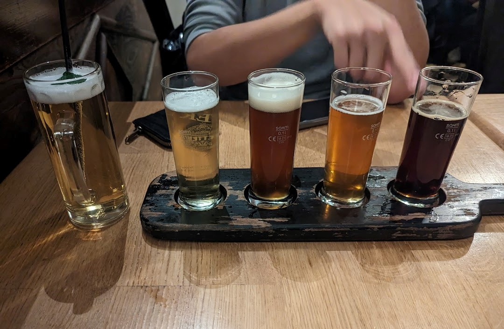

Being at OIST, I have 2 yearly trips funded by the graduate school. One of which I used it for a workshop travel in Germany. This was an EMBO practical course titled "Single-cell omics: depper to genomics" held in EMBL Heidelberg campus from 13-18 November 2022: [link](https://www.embl.org/about/info/course-and-conference-office/events/sic22-01/).

I've heard really good reviews about EMBO workshops which compelled me to sign up. At first, I was reluctant because I feel like it was a bit redundant and less relevant for me, as I have had experiences with library preparation and bioinformatics analysis. Nevertheless, I figured that I might learn something different, especially about the experimental part. Also, I was more interested in epigenetic sequencing, which unfortunately was not included in the workshop except for one or two lectures. Nevertheless, I had an amazing time there and did not regret joining the workshop at all. Definitely will go again for another workshop if I ever find something more relatable!

<blockquote class="twitter-tweet">
EMBO Practical Course &#39;Single-cell omics: deeper to genomics&#39; started yesterday 🥼🔬🤩 Here&#39;s a few snapshots from Day 2 ⬇️ Four more days to go!<a href="https://twitter.com/hashtag/EMBOSCOmics?src=hash&amp;ref_src=twsrc%5Etfw">#EMBOSCOmics</a> <a href="https://t.co/xjyGQsk89F">pic.twitter.com/xjyGQsk89F</a>
&mdash; EMBL Events (@EMBLEvents) <a href="https://twitter.com/EMBLEvents/status/1592179298416619520?ref_src=twsrc%5Etfw">November 14, 2022</a></blockquote> 

## About the workshop

### The content of the workshop

It was a week long workshop consisting of hands-on experimental and computational practicals, with some lectures between. The main techniques used during the workshop were:

- DNTR-seq: Direct nuclear tagmentation and RNA-seq (genome and RNA-seq on the same single-cell)
- Strand-seq: Sequencing of DNA template strands during DNA replication
In which both are done in single-cells.

Further, we also had lectures that include single-cell epigenetic sequencing and single-cell sorting techniques among others. I think it's definitely a good workshop for people who will be doing these experiments in their projects.

### The people

By the people I mean the instructors and other participants. They were some of the greatest people I've ever met and we really got along with each other.

Most of the attendees were from Europe, which is probably because of proximity. I also noticed that all of the participants were wet biologists, with most having barely no background in computational work. It was nice that we were able to share our experiences dealing with different things, as we all have different backgrounds. The instructors were also really helpful along the course. We went out downtown for dinner and drinks which was super nice.

In general, everyone was very supportive and friendly, definitely made it worthwile attending the course.

### During the workshop

While the workshop itself was comprehensive, I feel one of the most important part of the workshop was networking. We were able to talk to each other and also the instructor during the coffee breaks, lunch and dinner. I have to say that their food service was amazing.

 

### Some comments

While the workshop was very nice and interesting, I feel that the schedule was too packed, and we didn't have enough rest. For me, I wasn't able to be fully functional because I was just too sleepy during some of the occassions.

The poster session was also not very stimulating, we had limited time to present our own posters and no time at all to discuss in front of the posters. That was unfortunate but at least we were able to talk during breaks and dinners.

Other than that, it was a very nice workshop, and I was able to connect with people which I feel was the most important part of the course.

## About Heidelberg

Heidelberg was a very small city, I was a bit surprised that I probably went to most places in one day. It is famous for the Heidelberg castle which was really cool. Unfortunately, it was very foggy most of my time there, maybe I should visit again in the summer. The timing was also a bit early for Christmas market so I wasn't able to enjoy that.

As I only had several free days, I only walked around Heidelberg, here were the places I visited:

- Downtown Heidelberg
- Schloss or the castle
- Philosophers' walk
- Bars

It was totally different from Japan, and I think that it was a very beautiful city.

### Downtown Heidelberg

It's amazing! I've never been to other cities in Europe, but it totally feels like Europe.

 

### Schloss Heidelberg

This is probably the top tourist spot in Heidelberg. I think it was a very relaxing and nice spot.

 

&nbsp;

### Philosophers' walk

This is a hiking (walking?) path in the outskirts of the downtown, which is reachable by walking from downtown. Through this path, we can see the whole city, unfortunately on that day it was too foggy and I wasn't able to see anything. But, it was a really nice walk even though it was a bit tiring to go up the stairs.

 

&nbsp;
<a href="../assets/images/2023-02-01/philosopher_walk_2.jpg" imageanchor="1" style="margin-left: 1em; margin-right: 1em;">

### Bars!

The night life at Heidelberg was really not bad. The bars were very lively and had nice beer for cheap (well not expensive but not super cheap either). After the workshop, we went to several bars to get drinks, unfortunately we were too tired and had to leave early.

 

### Beer beer and beer

I've heard stories about German beer being really good so I did try it. It was amazing. Well, I've had similar stuff in Japan, but it's the norm there.

 

&nbsp;

### The food

The food was really great as well, but very very heavy, and everything tasted similar. I think I started wanting asian food after my 3rd day there hahaha. I particularly loved the schnitzel and the pork knuckle. Here are some of the places I thought were worth visiting:

First, I was recommended by the tech in my lab to get schnitzel at this place. I ended up going here twice because I really liked it. The portion was generous, the waiter was really nice, and the food was awesome. I enjoyed the mushroom sauce Schnitzel.

Weinstube Schnitzelbank: https://goo.gl/maps/1NujA1Fu7oSgncSW9

Here is the picture of the garlic sauce schnitzel:

 

Next, I wanted to get pork knuckle and to have some beers. Ended up going to this place, and I have to say that the pork knuckle was really great.

Vetter's Alt Heidelberger Brauhaus: https://goo.gl/maps/RrfJHd9dCzyBUejv5

 

## Conclusions

This was a very nice trip, my first time in Europe and definitely was totally different with what I was used to. I highly recommend the practical course, and I believe that other EMBO workshops are at the same level.